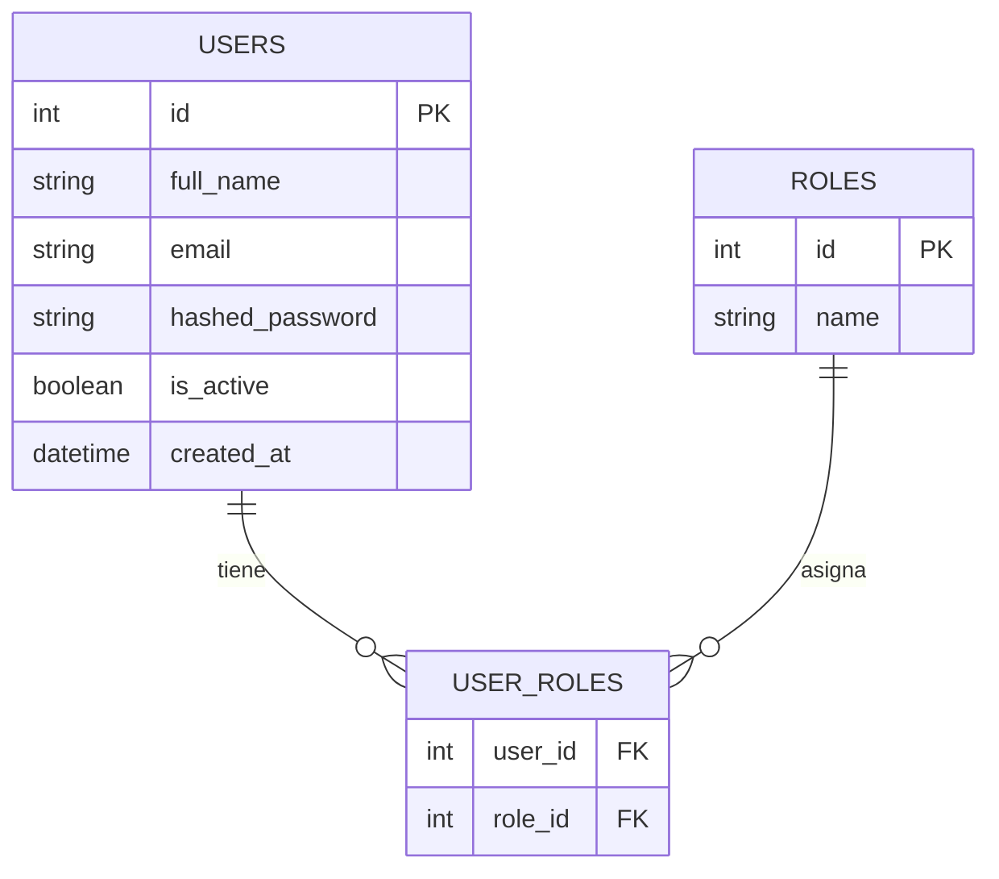

# Modelo inicial de base de datos: usuarios y roles

Este documento describe el modelo inicial de la base de datos utilizado para
representar usuarios, roles y la relacion entre ambos dentro del sistema. El
texto esta preparado para servir como base para crear una imagen, diagrama
entidad-relacion o esquema visual en otra herramienta.

## Objetivo del modelo

El objetivo de este modelo es permitir que el sistema controle el acceso de los
usuarios mediante roles. Un usuario puede tener uno o varios roles, y un rol
puede estar asignado a varios usuarios. Por esa razon se utiliza una tabla
intermedia llamada `user_roles`.

## Entidades principales

### Tabla `users`

Representa a las personas que pueden iniciar sesion en el sistema.

Campos principales:

| Campo | Tipo sugerido | Descripcion |
| --- | --- | --- |
| `id` | Integer, PK | Identificador unico del usuario |
| `full_name` | String | Nombre completo del usuario |
| `email` | String, unico | Nombre de usuario o correo usado para iniciar sesion |
| `hashed_password` | String | Contrasena cifrada del usuario |
| `is_active` | Boolean | Indica si el usuario esta activo |
| `created_at` | DateTime | Fecha de creacion del registro |

Responsabilidad:

- Guardar las credenciales y datos principales del usuario.
- Permitir autenticacion en el sistema.
- Relacionarse con uno o varios roles.

### Tabla `roles`

Representa los perfiles o niveles de acceso que puede tener un usuario.

Campos principales:

| Campo | Tipo sugerido | Descripcion |
| --- | --- | --- |
| `id` | Integer, PK | Identificador unico del rol |
| `name` | String, unico | Nombre del rol, por ejemplo `administrador`, `vendedor`, `caja` |

Responsabilidad:

- Definir grupos de acceso.
- Permitir clasificar usuarios segun sus responsabilidades.
- Relacionarse con varios usuarios.

### Tabla `user_roles`

Tabla intermedia que permite la relacion muchos a muchos entre usuarios y
roles.

Campos principales:

| Campo | Tipo sugerido | Descripcion |
| --- | --- | --- |
| `user_id` | Integer, FK | Referencia al campo `id` de la tabla `users` |
| `role_id` | Integer, FK | Referencia al campo `id` de la tabla `roles` |

Llave primaria sugerida:

- Compuesta por `user_id` y `role_id`.

Responsabilidad:

- Asociar usuarios con roles.
- Permitir que un usuario tenga varios roles.
- Permitir que un mismo rol pueda estar asignado a varios usuarios.

## Relaciones del modelo

Relaciones principales:

- `users` se relaciona con `user_roles` mediante `users.id = user_roles.user_id`.
- `roles` se relaciona con `user_roles` mediante `roles.id = user_roles.role_id`.
- La relacion entre `users` y `roles` es de muchos a muchos.

Explicacion sencilla:

- Un usuario puede ser administrador y vendedor al mismo tiempo.
- Un rol como administrador puede estar asignado a mas de un usuario.
- La tabla `user_roles` guarda esas combinaciones.

## Cardinalidad

| Relacion | Cardinalidad | Descripcion |
| --- | --- | --- |
| `users` a `user_roles` | 1 a muchos | Un usuario puede tener varios registros en `user_roles` |
| `roles` a `user_roles` | 1 a muchos | Un rol puede aparecer en varios registros de `user_roles` |
| `users` a `roles` | Muchos a muchos | La relacion real se resuelve mediante `user_roles` |

## Texto para generar una imagen

Crear un diagrama entidad-relacion con tres tablas:

1. Tabla `users`:
   - `id` como llave primaria.
   - `full_name`.
   - `email`.
   - `hashed_password`.
   - `is_active`.
   - `created_at`.

2. Tabla `roles`:
   - `id` como llave primaria.
   - `name`.

3. Tabla `user_roles`:
   - `user_id` como llave foranea hacia `users.id`.
   - `role_id` como llave foranea hacia `roles.id`.
   - Llave primaria compuesta por `user_id` y `role_id`.

Mostrar la relacion:

- `users` 1 a muchos con `user_roles`.
- `roles` 1 a muchos con `user_roles`.
- `users` y `roles` quedan relacionados como muchos a muchos mediante
  `user_roles`.

## Diagrama en formato Mermaid

Este bloque puede copiarse en una herramienta compatible con Mermaid para
generar el diagrama.

## Descripcion para informe academico

El modelo inicial de seguridad del sistema se compone de tres tablas:
`users`, `roles` y `user_roles`. La tabla `users` almacena la informacion de
los usuarios que pueden acceder al sistema, incluyendo su nombre, usuario o
correo, contrasena cifrada y estado activo. La tabla `roles` almacena los
perfiles disponibles dentro del sistema, como administrador, vendedor o caja.

Debido a que un usuario puede tener mas de un rol y un rol puede pertenecer a
varios usuarios, se incorpora la tabla intermedia `user_roles`. Esta tabla
permite implementar una relacion muchos a muchos entre usuarios y roles,
manteniendo el modelo flexible para futuros permisos y modulos del sistema.

## Ejemplo de lectura del modelo

Si existe un usuario llamado `Administrador` y un rol llamado `administrador`,
la tabla `user_roles` guarda un registro que une el `id` del usuario con el
`id` del rol. De esa forma, cuando el usuario inicia sesion, el sistema puede
consultar sus roles y determinar que opciones debe permitirle utilizar.
