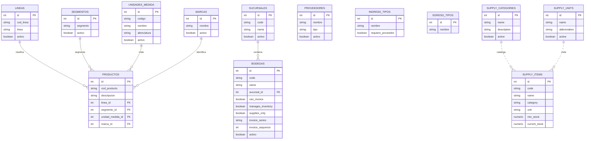

# Modelo relacional de catalogos maestros

Este documento describe el modelo relacional de los catalogos maestros del
sistema. Esta preparado para tomar la informacion y pasarla a otra herramienta
que genere imagenes, diagramas entidad-relacion, mapas de datos o documentacion
visual.

Los catalogos maestros son tablas base que alimentan otros procesos del sistema.
No representan una venta o un movimiento por si solos, pero son necesarios para
crear productos, bodegas, sucursales, proveedores, insumos, tasas, usuarios y
procesos operativos.

## Objetivo del modelo

El objetivo del modelo de catalogos maestros es centralizar datos repetitivos y
evitar que el usuario escriba informacion diferente para el mismo concepto.

Ejemplos:

- Una linea de producto se selecciona desde `lineas`.
- Una unidad de medida se selecciona desde `unidades_medida`.
- Una bodega se selecciona desde `bodegas`.
- Una categoria de insumo se selecciona desde `supply_categories`.
- Una sucursal se selecciona desde `sucursales`.

## Grupos de catalogos maestros

| Grupo | Tablas principales | Uso |
| --- | --- | --- |
| Catalogos de productos | `lineas`, `segmentos`, `unidades_medida`, `marcas` | Clasificar productos |
| Catalogos logisticos | `sucursales`, `bodegas` | Organizar ubicaciones, inventario y facturacion |
| Catalogos comerciales | `proveedores`, `vendedores`, `clientes` | Registrar terceros del negocio |
| Catalogos de movimientos | `ingreso_tipos`, `egreso_tipos` | Clasificar entradas y salidas de inventario |
| Catalogos de insumos | `supply_categories`, `supply_units`, `supply_items` | Controlar insumos internos no mercaderia |
| Catalogos de configuracion | `business_settings`, `company_environments`, `exchange_rates` | Parametrizar empresa, entorno y moneda |
| Catalogos de seguridad | `users`, `roles`, `permissions`, `user_roles`, `role_permissions` | Controlar acceso al sistema |

## Catalogos de productos

### Tabla `lineas`

Representa las lineas generales de productos.

| Campo | Tipo | Descripcion |
| --- | --- | --- |
| `id` | Integer, PK | Identificador unico |
| `cod_linea` | String, unico | Codigo de la linea |
| `linea` | String | Nombre de la linea |
| `activo` | Boolean | Estado activo/inactivo |
| `registro` | DateTime | Fecha de registro |

Relacion:

- `lineas.id` se relaciona con `productos.linea_id`.
- Una linea puede tener muchos productos.

### Tabla `segmentos`

Representa clasificaciones secundarias o segmentos de productos.

| Campo | Tipo | Descripcion |
| --- | --- | --- |
| `id` | Integer, PK | Identificador unico |
| `segmento` | String, unico | Nombre del segmento |
| `activo` | Boolean | Estado activo/inactivo |
| `registro` | DateTime | Fecha de registro |

Relacion:

- `segmentos.id` se relaciona con `productos.segmento_id`.
- Un segmento puede estar asignado a muchos productos.

### Tabla `unidades_medida`

Representa unidades usadas para productos e inventario.

| Campo | Tipo | Descripcion |
| --- | --- | --- |
| `id` | Integer, PK | Identificador unico |
| `codigo` | String, unico | Codigo de unidad |
| `nombre` | String | Nombre de unidad |
| `abreviatura` | String | Abreviatura visual |
| `activo` | Boolean | Estado activo/inactivo |
| `created_at` | DateTime | Fecha de creacion |

Relacion:

- `unidades_medida.id` se relaciona con `productos.unidad_medida_id`.
- Tambien puede usarse en recetas o lineas de produccion.

### Tabla `marcas`

Representa marcas comerciales de productos.

| Campo | Tipo | Descripcion |
| --- | --- | --- |
| `id` | Integer, PK | Identificador unico |
| `nombre` | String, unico | Nombre de marca |
| `activo` | Boolean | Estado activo/inactivo |
| `created_at` | DateTime | Fecha de creacion |

Relacion:

- `marcas.id` se relaciona con `productos.marca_id`.
- Una marca puede tener muchos productos.

## Catalogos logisticos

### Tabla `sucursales`

Representa sucursales o sedes de la empresa.

| Campo | Tipo | Descripcion |
| --- | --- | --- |
| `id` | Integer, PK | Identificador unico |
| `code` | String, unico | Codigo de sucursal |
| `name` | String | Nombre de sucursal |
| `address` | String | Direccion |
| `phone` | String | Telefono |
| `activo` | Boolean | Estado activo/inactivo |
| `created_at` | DateTime | Fecha de creacion |

Relaciones:

- `sucursales.id` se relaciona con `bodegas.sucursal_id`.
- `sucursales.id` se relaciona con `vendedores.sucursal_id`.
- `sucursales.id` se relaciona con `user_access_profiles.sucursal_id`.

### Tabla `bodegas`

Representa bodegas, puntos de inventario o ubicaciones operativas.

| Campo | Tipo | Descripcion |
| --- | --- | --- |
| `id` | Integer, PK | Identificador unico |
| `code` | String, unico | Codigo de bodega |
| `name` | String | Nombre de bodega |
| `sucursal_id` | Integer, FK | Sucursal asociada |
| `can_invoice` | Boolean | Indica si la bodega puede facturar |
| `manages_inventory` | Boolean | Indica si gestiona inventario |
| `supplies_only` | Boolean | Indica si es solo para insumos |
| `invoice_series` | String | Serie de facturacion asignada |
| `invoice_sequence` | Integer | Consecutivo actual |
| `activo` | Boolean | Estado activo/inactivo |
| `created_at` | DateTime | Fecha de creacion |

Relaciones:

- `bodegas.sucursal_id` referencia `sucursales.id`.
- `bodegas.id` se usa en ventas, inventario, caja, usuarios y vendedores.
- Una sucursal puede tener muchas bodegas.

## Catalogos comerciales

### Tabla `proveedores`

Representa proveedores usados en compras o inventario.

| Campo | Tipo | Descripcion |
| --- | --- | --- |
| `id` | Integer, PK | Identificador unico |
| `nombre` | String, unico | Nombre del proveedor |
| `tipo` | String | Tipo de proveedor |
| `activo` | Boolean | Estado activo/inactivo |
| `created_at` | DateTime | Fecha de creacion |

Relacion:

- `proveedores.id` puede asociarse a ingresos de inventario.

### Tabla `vendedores`

Representa vendedores o responsables comerciales.

| Campo | Tipo | Descripcion |
| --- | --- | --- |
| `id` | Integer, PK | Identificador unico |
| `code` | String, unico | Codigo del vendedor |
| `nombre` | String | Nombre del vendedor |
| `user_id` | Integer, FK | Usuario vinculado |
| `sucursal_id` | Integer, FK | Sucursal asignada |
| `bodega_id` | Integer, FK | Bodega asignada |
| `telefono` | String | Telefono |
| `email` | String | Correo |
| `meta_ventas` | Numeric | Meta comercial |
| `activo` | Boolean | Estado activo/inactivo |
| `created_at` | DateTime | Fecha de creacion |

Relaciones:

- `vendedores.user_id` referencia `users.id`.
- `vendedores.sucursal_id` referencia `sucursales.id`.
- `vendedores.bodega_id` referencia `bodegas.id`.

### Tabla `clientes`

Representa clientes para ventas.

| Campo | Tipo | Descripcion |
| --- | --- | --- |
| `id` | Integer, PK | Identificador unico |
| `nombre` | String | Nombre del cliente |
| `telefono` | String | Telefono |
| `identificacion` | String | RUC, cedula u otro documento |
| `direccion` | String | Direccion |
| `email` | String | Correo |
| `tipo` | String | Tipo de cliente |
| `activo` | Boolean | Estado activo/inactivo |
| `created_at` | DateTime | Fecha de creacion |

Relacion:

- Puede asociarse a facturas de venta.

## Catalogos de movimientos

### Tabla `ingreso_tipos`

Clasifica tipos de entrada de inventario.

| Campo | Tipo | Descripcion |
| --- | --- | --- |
| `id` | Integer, PK | Identificador unico |
| `nombre` | String, unico | Nombre del tipo de ingreso |
| `requiere_proveedor` | Boolean | Indica si exige proveedor |
| `created_at` | DateTime | Fecha de creacion |

Relacion:

- `ingreso_tipos.id` se relaciona con `ingresos_inventario.tipo_id`.

### Tabla `egreso_tipos`

Clasifica tipos de salida de inventario.

| Campo | Tipo | Descripcion |
| --- | --- | --- |
| `id` | Integer, PK | Identificador unico |
| `nombre` | String, unico | Nombre del tipo de egreso |
| `created_at` | DateTime | Fecha de creacion |

Relacion:

- `egreso_tipos.id` se relaciona con `egresos_inventario.tipo_id`.

## Catalogos de insumos

### Tabla `supply_categories`

Clasifica insumos internos.

| Campo | Tipo | Descripcion |
| --- | --- | --- |
| `id` | Integer, PK | Identificador unico |
| `name` | String, unico | Nombre de categoria |
| `description` | String | Descripcion |
| `active` | Boolean | Estado activo/inactivo |
| `created_at` | DateTime | Fecha de creacion |

Uso:

- Se usa para llenar el campo `category` en `supply_items`.

### Tabla `supply_units`

Define unidades de medida para insumos.

| Campo | Tipo | Descripcion |
| --- | --- | --- |
| `id` | Integer, PK | Identificador unico |
| `name` | String, unico | Nombre de unidad |
| `abbreviation` | String | Abreviatura |
| `active` | Boolean | Estado activo/inactivo |
| `created_at` | DateTime | Fecha de creacion |

Uso:

- Se usa para llenar el campo `unit` en `supply_items` y lineas de cotizacion.

### Tabla `supply_items`

Representa insumos internos que no son mercaderia para venta.

| Campo | Tipo | Descripcion |
| --- | --- | --- |
| `id` | Integer, PK | Identificador unico |
| `code` | String, unico | Codigo de insumo |
| `name` | String | Nombre del insumo |
| `category` | String | Categoria seleccionada |
| `unit` | String | Unidad seleccionada |
| `min_stock` | Numeric | Stock minimo |
| `current_stock` | Numeric | Stock actual |
| `location` | String | Ubicacion |
| `notes` | Text | Observaciones |
| `active` | Boolean | Estado activo/inactivo |
| `created_at` | DateTime | Fecha de creacion |

Relaciones:

- `supply_items.id` se relaciona con `supply_movements.item_id`.
- `supply_items.id` se relaciona con `quote_request_lines.supply_item_id`.

## Catalogos de configuracion

### Tabla `business_settings`

Guarda datos generales y politicas del negocio.

Campos principales:

- `business_name`
- `legal_name`
- `trade_name`
- `app_title`
- `sidebar_subtitle`
- `address`
- `ruc`
- `phone`
- `phones`
- `email`
- `website`
- `theme_code`
- `sales_interface_code`
- `pricing_currency`
- `logo_login`
- `logo_sidebar`
- `logo_invoice`
- `logo_favicon`
- Politicas de inventario, ventas, recetas, sucursales y precios.

Uso:

- Parametriza identidad visual y reglas generales del sistema.

### Tabla `company_environments`

Guarda entornos empresariales o conexiones de empresa.

Campos principales:

- `id`
- `company_key`
- `company_name`
- `database_url`
- `is_active`

Uso:

- Permite registrar entornos o bases empresariales.

### Tabla `exchange_rates`

Guarda tasas de cambio.

Campos principales:

- `id`
- `effective_date`
- `period_type`
- `rate`
- `notes`
- `is_active`
- `created_at`

Uso:

- Sirve para conversiones entre USD y Cordobas en ventas, inventario y reportes.

## Relaciones principales resumidas

| Tabla origen | Relacion | Tabla destino | Cardinalidad |
| --- | --- | --- | --- |
| `lineas` | clasifica | `productos` | 1 a muchos |
| `segmentos` | clasifica | `productos` | 1 a muchos |
| `unidades_medida` | mide | `productos` | 1 a muchos |
| `marcas` | identifica | `productos` | 1 a muchos |
| `sucursales` | contiene | `bodegas` | 1 a muchos |
| `sucursales` | asigna | `vendedores` | 1 a muchos |
| `bodegas` | almacena | `saldos_productos` | 1 a muchos |
| `bodegas` | participa | `sales_invoices` | 1 a muchos |
| `proveedores` | participa | `ingresos_inventario` | 1 a muchos |
| `ingreso_tipos` | clasifica | `ingresos_inventario` | 1 a muchos |
| `egreso_tipos` | clasifica | `egresos_inventario` | 1 a muchos |
| `supply_items` | tiene | `supply_movements` | 1 a muchos |
| `supply_items` | se solicita en | `quote_request_lines` | 1 a muchos |

## Diagrama Mermaid general

Este bloque puede copiarse en una herramienta compatible con Mermaid.

## Texto para generar imagen en otra herramienta

Crear un diagrama entidad-relacion titulado:

`Modelo relacional de catalogos maestros del ERP`

Incluir los siguientes grupos:

1. Catalogos de productos:
   - `lineas`
   - `segmentos`
   - `unidades_medida`
   - `marcas`
   - conectados con `productos`.

2. Catalogos logisticos:
   - `sucursales`
   - `bodegas`
   - mostrar `sucursales` 1 a muchos con `bodegas`.
   - en `bodegas` destacar politicas:
     `can_invoice`, `manages_inventory`, `supplies_only`, `invoice_series`.

3. Catalogos comerciales:
   - `proveedores`
   - `vendedores`
   - `clientes`.

4. Catalogos de movimientos:
   - `ingreso_tipos`
   - `egreso_tipos`.

5. Catalogos de insumos:
   - `supply_categories`
   - `supply_units`
   - `supply_items`.

6. Catalogos de configuracion:
   - `business_settings`
   - `company_environments`
   - `exchange_rates`.

Usar flechas de 1 a muchos donde corresponda. Usar color diferente por grupo
para facilitar la lectura del diagrama.

## Nota academica

El modelo relacional de catalogos maestros permite que el sistema mantenga
orden en sus datos base. Estos catalogos funcionan como soporte para los modulos
operativos. Por ejemplo, antes de registrar un producto se necesitan lineas,
segmentos, unidades, marcas y bodegas. Antes de registrar una venta se necesita
una bodega configurada. Antes de crear un insumo se necesitan categorias y
unidades. Esta separacion mejora la consistencia de datos y facilita el
mantenimiento del sistema.
